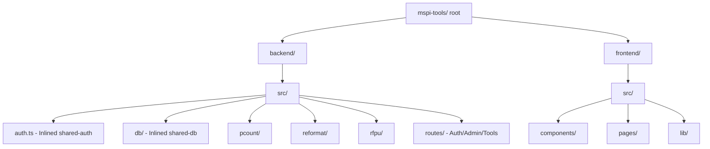

# Architecture Overview

This project implements the internal tools hub for MSPI (`tools.mspi.io`). 

Initially, it was built as a Turborepo monorepo with multiple independent workspaces under `apps/` and `packages/`. It has since been **restructured into a flat layout** comprising a single unified `backend/` and `frontend/` directory to simplify development, dependency management, and deployment.

---

## 🛠️ The Flat Layout

### 1. Inlined Shared Libraries
The common packages from the monorepo were consolidated inside the backend:
- **`@mspi/shared-auth`** → Inlined to [backend/src/auth.ts](file:///Users/karlgarcia/Desktop/Dev/mspi-tools/backend/src/auth.ts)
- **`@mspi/shared-db`** → Inlined to [backend/src/db/](file:///Users/karlgarcia/Desktop/Dev/mspi-tools/backend/src/db/)

### 2. Unified Express Gateway
The backend [backend/src/index.ts](file:///Users/karlgarcia/Desktop/Dev/mspi-tools/backend/src/index.ts) is an Express server functioning as a API Gateway. It:
- Initializes the MySQL connection pool.
- Registers core middleware: CORS (supporting custom allowed origins), body parser, cookie parser, compression.
- Mounts shared routes: Auth (`/api/auth`), Admin (`/api/admin`), and Tools management (`/api`).
- Dynamically imports and mounts tool-specific sub-routers and startup initializers:
  - `/api/pcount` (Physical Count)
  - `/api/rfpu` (RFPU Tool)
  - `/api/reformat` (Excel Reformatting)
- Serves the frontend static bundle in production (from `backend/src/public`).

### 3. Shared React Frontend
The frontend [frontend/src/App.tsx](file:///Users/karlgarcia/Desktop/Dev/mspi-tools/frontend/src/App.tsx) is a React Single Page Application (SPA) powered by Vite. It:
- Integrates all pages for different tools (PCount, RFPU, Reformat) under one React Router config.
- Employs React lazy-loading (`Suspense` + `lazy`) to split bundles for optimal load times.
- Uses a unified authorization context provider (`AuthProvider` in `frontend/src/lib/auth.tsx`) to guard private routes.
- Interacts with backend API routes via a central `/api` proxy configured in `vite.config.ts`.
- Implements visual layouts (e.g. `Layout.tsx` navbar dashboard wrapper).

---

## 🔗 Related Notes
- [[Authentication & SSO]]
- [[Database Schema]]
- [[Tool - PCount]]
- [[Tool - Reformat]]
