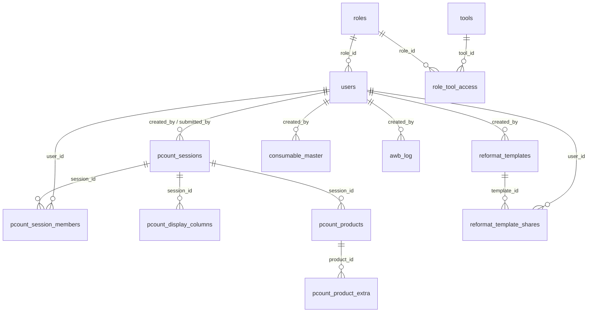

# Database Schema

The system uses **MySQL** as its single shared database database engine. Schema definitions and queries are managed using **Drizzle ORM** (defined in [backend/src/db/schema.ts](file:///Users/karlgarcia/Desktop/Dev/mspi-tools/backend/src/db/schema.ts)).

---

## 📊 Database Entity Relationship Diagram

---

## 🗄️ Tables Specifications

### 🛡️ Core Authorization & Tools Dashboard

#### `roles`
Stores the access levels (e.g. `'Admin'`, `'Operator'`, etc.).
- `id` (`int`, PK, Auto-increment)
- `name` (`varchar(50)`, Unique, Not Null)

#### `users`
Registered user accounts.
- `id` (`int`, PK, Auto-increment)
- `email` (`varchar(255)`, Unique, Not Null)
- `password_hash` (`varchar(255)`, Not Null)
- `full_name` (`varchar(255)`, Not Null)
- `role_id` (`int`, Foreign Key -> `roles.id`, Nullable, `ON DELETE SET NULL`)
- `created_at` (`timestamp`, default current time)

#### `tools`
Available tools that can show up dynamically on the launcher page.
- `id` (`int`, PK, Auto-increment)
- `name` (`varchar(100)`, Not Null)
- `url` (`varchar(500)`, Not Null)
- `icon` (`varchar(50)`, Not Null) — FontAwesome icon name
- `description` (`varchar(500)`, Not Null)

#### `role_tool_access`
Many-to-many relationship mapping which roles can launch which tools.
- `role_id` (`int`, FK -> `roles.id`, Not Null, `ON DELETE CASCADE`)
- `tool_id` (`int`, FK -> `tools.id`, Not Null, `ON DELETE CASCADE`)
- **PK**: `(role_id, tool_id)`

---

### 📦 Physical Count (`pcount`)

#### `pcount_sessions`
Active or submitted inventory counting events.
- `id` (`int`, PK, Auto-increment)
- `name` (`varchar(255)`, Not Null)
- `status` (`varchar(20)`, Default `'active'`, Not Null)
- `sort_desc` (`int`, Default `1`) — Toggle sort order direction
- `created_by` (`int`, FK -> `users.id`, `ON DELETE SET NULL`)
- `join_code` (`varchar(4)`, Unique) — 4-digit code scanners use to join session
- `submitted_at` (`timestamp`, Nullable)
- `submitted_by` (`int`, FK -> `users.id`, `ON DELETE SET NULL`)
- `created_at` / `updated_at` (`timestamp`)

#### `pcount_session_members`
Active scan operators allowed to participate in a counting session.
- `session_id` (`int`, FK -> `pcount_sessions.id`, `ON DELETE CASCADE`)
- `user_id` (`int`, FK -> `users.id`, `ON DELETE CASCADE`)
- `joined_at` (`timestamp`)
- **PK**: `(session_id, user_id)`

#### `pcount_display_columns`
Custom configuration columns imported for a session.
- `id` (`int`, PK, Auto-increment)
- `session_id` (`int`, FK -> `pcount_sessions.id`, `ON DELETE CASCADE`)
- `column_name` (`varchar(255)`, Not Null)

#### `pcount_products`
The products list imported from standard sheet files to be counted.
- `id` (`int`, PK, Auto-increment)
- `session_id` (`int`, FK -> `pcount_sessions.id`, `ON DELETE CASCADE`)
- `product_code` (`varchar(255)`, Not Null)
- `description` (`varchar(500)`)
- `category` (`varchar(20)`)
- `system_qty` (`int`, Default `0`)
- `counted_qty` (`int`, Default `0`)
- `adjusted_qty` (`int`, Nullable) — Admin correction
- `status` (`varchar(20)`, Default `'pending'`) — e.g. `'pending'`, `'counted'`, `'flagged'`
- `notes` (`text`)
- **Index**: `pcount_products_session_code_idx` on `(session_id, product_code)` for rapid scanning queries.

#### `pcount_product_extra`
Stores arbitrary spreadsheet columns (in key-value mapping) that are not natively supported in the main schema.
- `id` (`int`, PK, Auto-increment)
- `product_id` (`int`, FK -> `pcount_products.id`, `ON DELETE CASCADE`)
- `column_name` (`varchar(255)`, Not Null)
- `column_value` (`text`)

---

### 📋 Reformat Tool (`reformat`)

#### `reformat_templates`
Custom reformatting templates defined by users.
- `id` (`int`, PK, Auto-increment)
- `name` (`varchar(255)`, Not Null)
- `header_row` (`int`, Default `1`)
- `columns` (`text`) — JSON string defining layout mappings
- `removed_columns` (`text`) — JSON list of strings
- `created_by` (`int`, FK -> `users.id`, `ON DELETE CASCADE`)
- `created_at` / `updated_at` (`timestamp`)

#### `reformat_template_shares`
Mappings for template sharing among team members.
- `template_id` (`int`, FK -> `reformat_templates.id`, `ON DELETE CASCADE`)
- `user_id` (`int`, FK -> `users.id`, `ON DELETE CASCADE`)
- `shared_at` (`timestamp`)
- **PK**: `(template_id, user_id)`

---

### 🏷️ Consumables / Label Maker (`consumables`)

#### `consumable_master`
Master list of consumable parts used by the Label Maker.
- `id` (`int`, PK, Auto-increment)
- `part_number` (`varchar(100)`, Not Null, **Unique**) — upsert key for bulk imports
- `description` (`varchar(255)`, Not Null)
- `category` (`varchar(100)`, Default `'Other'`)
- `expires` (`varchar(1)`, Default `'Y'`) — whether the part has an expiry (drives 9D-code expiry derivation)
- `unit` (`varchar(20)`, Default `'pcs'`)
- `created_by` (`int`, FK -> `users.id`, `ON DELETE SET NULL`)
- `created_at` / `updated_at` (`timestamp`)

---

### 📄 PDF Extractor (`awb_log`)

#### `awb_log`
One row per extracted invoice; unique on the invoice reference so re-processing updates instead of duplicating.
- `id` (`int`, PK, Auto-increment)
- `invoice_reference` (`varchar(20)`, Not Null, **Unique**)
- `hawb`, `invoice_total_amount`, `delivery_date`, `total_qty`, `received_date` (`varchar`, default empty — received date left blank by design)
- `original_filename`, `month_folder` — provenance + filed-to folder
- `status` (`varchar(20)`, Default `'ok'`) — `ok` / `duplicate` / `error` / `permit`
- `created_by` (`int`, FK -> `users.id`, `ON DELETE SET NULL`)
- `date_logged` (`timestamp`)

---

## 🔗 Related Notes
- [[Architecture Overview]]
- [[Authentication & SSO]]
- [[Tool - Consumables]]
- [[Tool - PDF Extractor]]
