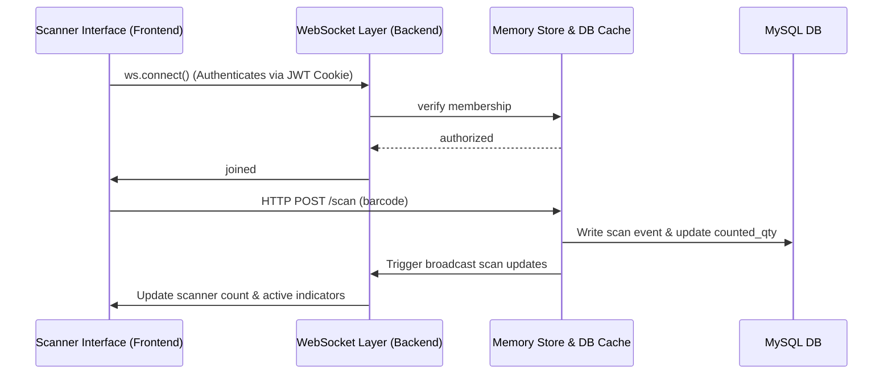

# Tool - PCount (Physical Count)

The **Physical Count (PCount)** tool is a real-time web utility designed to allow warehouse operators to concurrently scan and record physical item counts against expected system inventory levels.

---

## 🏗️ Architecture

PCount relies heavily on real-time messaging and performance caching to ensure operators scanning barcodes experience zero latency, even during database fluctuations.

---

## 📡 Real-Time Sync & WebSocket (WS)

The WebSocket server is mounted on `/ws` route in [backend/src/pcount/ws.ts](file:///Users/karlgarcia/Desktop/Dev/mspi-tools/backend/src/pcount/ws.ts):
- **Join Session**: Handled via `msg.type === 'join'`. Requires the 4-digit `join_code`.
- **IP-Based Distinct Counts**: Displays how many operators are actively scanning. To prevent double-counting a user who has multiple tabs/connections, unique user counts are aggregated using IP addresses.
- **Connection Heartbeats**: Clients send `'heartbeat'` events. Active scanners are considered online if a heartbeat was received within the last 30 seconds.
- **Broadcast Events**: Any change triggers a payload broadcast to all sockets registered in that session:
  - `scanner_count`: active operator count and online count updates.
  - `scan_update`: alerts other connected operator screens to update values without manual page refresh.

---

## 💾 Caching & In-Memory Store (`store.ts`)

A core strength of the PCount backend is its cache-aside database driver in [backend/src/pcount/store.ts](file:///Users/karlgarcia/Desktop/Dev/mspi-tools/backend/src/pcount/store.ts):
- **Database Status Flag (`dbAvailable`)**: If MySQL is offline, the backend transitions automatically to in-memory transient data stores (`sessions`, `products`, `members` maps) to ensure operations do not grind to a halt.
- **Indexing**: Products are indexed using `(session_id, product_code)` to enable millisecond queries for quick scans.
- **Arbitrary Fields Map**: Excel sheets containing custom columns are saved inside `pcount_product_extra` using key-value entries. When queried, `attachExtras()` aggregates these rows dynamically.

---

## 🎨 UI Pages & Components

### Pages (located in `frontend/src/pages/pcount/`)
- **[IndexPage.tsx](file:///Users/karlgarcia/Desktop/Dev/mspi-tools/frontend/src/pages/pcount/IndexPage.tsx)**: 
  - Lists the user's active/submitted counting sessions.
  - Form to create new sessions.
  - Code entry modal to join a session via 4-digit `join_code`.
- **[SessionPage.tsx](file:///Users/karlgarcia/Desktop/Dev/mspi-tools/frontend/src/pages/pcount/SessionPage.tsx)**:
  - Core scanning dashboard.
  - Real-time list of products, showing discrepancies between System Qty and Counted Qty.
  - WebSockets status connection indicator.
  - Actions: Import System sheet, Import Counts sheet, download report (uses `xlsx` bundle).

### Key Components (located in `frontend/src/components/pcount/`)
- **`ScanBar`**: Numeric input or hardware scanner field capturing barcode submissions.
- **`ScanPanel`**: Audio-visual feedback panel showing green/red indicators for successful/failed scans.
- **`ImportSystem` / `ImportCount`**: Mappings drag-and-drop file readers parsing spreadsheets.
- **`ProductTable`**: Virtualized/paginated data grid displaying counts, categories, notes, and discrepancies.
- **`ProgressCircle`**: Radial svg indicator displaying overall count completion percentage.

---

## 🔗 Related Notes
- [[Architecture Overview]]
- [[Database Schema]]
